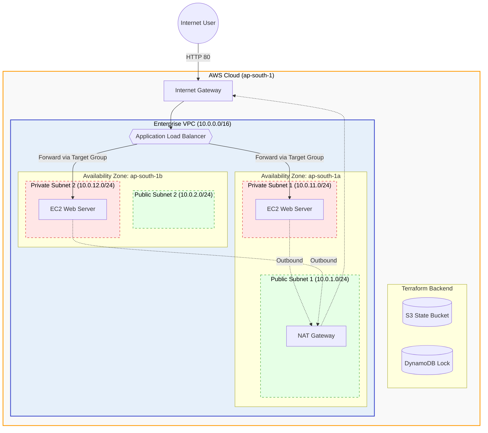

# Enterprise ready AWS Infrastructure as Code (IaC) Architecture

This repository contains the Terraform source code to provision a highly available, secure network and web server architecture in AWS (`ap-south-1`). 

It demonstrates Zero-Trust networking principles, multi-AZ fault tolerance, and declarative state management.

## Architecture & Security



* **State Locking (The Backend):** Configured to use a remote S3 bucket for state storage and a DynamoDB table for strict state-locking, preventing concurrent pipeline mutations.
* **The VPC (Network Isolation):** A custom Virtual Private Cloud spanning two Availability Zones in Mumbai (`ap-south-1a`, `ap-south-1b`).
* **The Public Tier (Ingress):** Houses the Application Load Balancer (ALB), an Internet Gateway, and NAT Gateways.
* **The Private Tier (Zero Trust):** Houses an Auto Scaling Group (ASG) of web servers. **Security Posture:** The web servers reside in private subnets with no public IP addresses. Their Security Group explicitly denies all inbound traffic except from the ALB. Outbound traffic is securely routed through a NAT gateway for system updates.

## Repository Structure

* `providers.tf` - AWS Provider configuration and Remote Backend setup.
* `variables.tf` - Dynamic parameters (CIDR blocks, Regions).
* `network.tf` - VPC, Public, and Private Subnet provisioning.
* `gateways.tf` - Internet Gateway, NAT Gateway, and Route Tables.
* `security.tf` - Ingress/Egress Security Groups for ALB and EC2 instances.
* `compute.tf` - Auto Scaling Group, ALB, and dynamic AMI fetching (Ubuntu 24.04).

## Execution & Validation

This code has been strictly formatted (`terraform fmt`), validated (`terraform validate`), and successfully planned against the live AWS API.

**Execution Plan Output:**
```bash
$ terraform plan
...
Plan: 21 to add, 0 to change, 0 to destroy.
